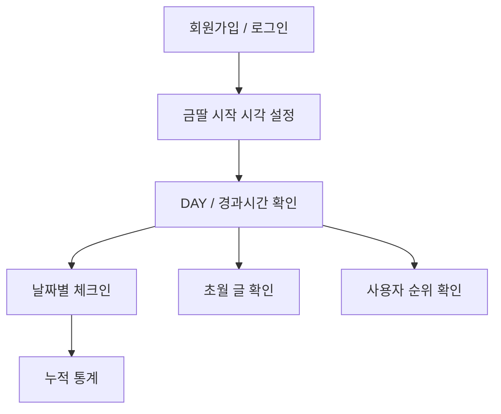
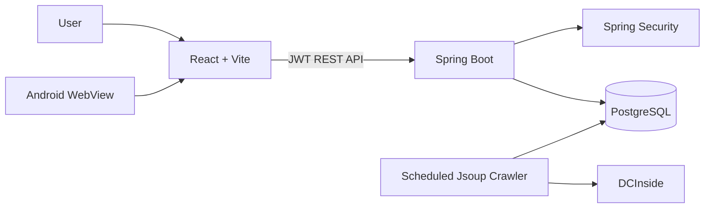

<div align="center">


# 🟡 GoldenDaughter

### 금딸 기록 · 체크인 · 사용자 순위 · 동기부여 콘텐츠를 한곳에서

**현재 연속 기록을 실시간으로 확인하고,**  
**하루 단위 체크인과 사용자 순위를 통해 꾸준한 기록을 이어갈 수 있도록 만든 모바일 중심 서비스입니다.**

[](https://golden-daughter.kro.kr)
[](https://golden-daughter.kro.kr/GoldenDaughter.apk)

[](https://react.dev/)
[](https://vite.dev/)
[](https://spring.io/projects/spring-boot)
[](https://www.postgresql.org/)
[](https://vercel.com/)
[](https://railway.com/)

</div>

---

## 🚀 서비스 개요

**GoldenDaughter**는 단순히 금딸 시작일만 저장하는 카운터 앱이 아닙니다.

현재 기록이 얼마나 이어지고 있는지 실시간으로 확인하고, 날짜별로 **성공 / 위기 / 실패 체크인**을 남기며, 다른 사용자와 현재 기록을 비교할 수 있도록 구성했습니다.

또한 현자타임 갤러리의 `초월` 말머리 글을 백엔드에서 주기적으로 수집해 앱 안에서 랜덤으로 보여주도록 하여 **기록 + 동기부여 + 경쟁 요소**를 하나의 흐름으로 묶었습니다.

> 순위는 현재 진행 중인 streak의 실제 시작 시각을 기준으로 계산합니다.  
> 랭킹에는 닉네임, DAY, 경과시간만 표시하며 이메일과 같은 계정 정보는 노출하지 않습니다.

### 🔗 주요 링크

| 서비스 | URL |
| --- | --- |
| Web App | [golden-daughter.kro.kr](https://golden-daughter.kro.kr) |
| Android APK | [GoldenDaughter.apk](https://golden-daughter.kro.kr/GoldenDaughter.apk) |
| Backend Repository | [GoldenDaughter_BackEnd](https://github.com/dh1180/GoldenDaughter_BackEnd) |

---

## ✨ 핵심 기능

### ⏱ 현재 Streak

- 실제 시작 날짜/시간 지정
- 현재 `DAY` 표시
- 시작 시각 기준 경과시간 실시간 계산
- 다음 목표 DAY 표시
- 기록 리셋
- 기록 리셋 시 이전 streak는 보존

### 📅 일일 체크인

월간 캘린더에서 날짜별 상태와 메모를 저장합니다.

- `SUCCESS` — 성공
- `CRISIS` — 위기 있었음
- `FAILED` — 실패
- 날짜별 메모 작성
- 기존 체크인 수정
- 탭 이동 후 다시 돌아와도 선택 날짜의 서버 기록 자동 동기화

### ♛ 사용자 금딸 순위

현재 진행 중인 사용자들의 streak를 비교해 순위를 제공합니다.

- 실제 `startedAt`이 빠른 순서로 정렬
- TOP 100 표시
- 현재 참여 사용자 수 표시
- 내 순위 별도 표시
- 같은 DAY라도 실제 경과시간으로 순위 구분
- 공개 정보는 닉네임 / DAY / 경과시간으로 제한

```text
1위  DAY 41  40일 12:30:18
2위  DAY 41  40일 03:12:44
3위  DAY 38  37일 21:05:31
```

### 🌌 DCInside `초월` 글

현자타임 갤러리의 `초월` 말머리 글을 서버에서 수집해 동기부여 콘텐츠로 제공합니다.

- 최신 페이지 주기적 확인
- 과거 페이지 순차 Backfill
- DB에 수집 상태 저장
- 게시글 번호 기준 중복 방지
- 앱에서 랜덤 글 노출
- `다른 초월글`로 즉시 새 글 불러오기
- DCInside 원문 바로가기

과거 글은 한 번에 모든 페이지를 요청하지 않고 여러 번에 나누어 순차 수집합니다.

```text
1회차  page 1  → page 20
2회차  page 21 → page 40
3회차  page 41 → page 60
...
```

### 📊 개인 통계

- 현재 기록
- 최고 기록
- 성공 체크인 수
- 실패 체크인 수

### 📱 Android App

웹과 별도의 UI를 다시 만드는 대신 **Native Android WebView Wrapper**를 사용해 동일한 React 앱을 Android에서 실행합니다.

- Android WebView 기반
- 내부 서비스 링크는 앱 내부에서 유지
- 외부 링크는 기본 브라우저로 실행
- 상태바 / 시스템 영역 대응
- WebView 캐시 비활성화
- 앱 실행 시 최신 웹 배포본 요청
- GitHub Actions에서 APK 자동 빌드

현재 Android 앱 버전은 `1.0.6`입니다.

---

## 🧭 사용 흐름



---

## 🏗 Architecture



### 인증 흐름

```text
Client
  ↓ Authorization: Bearer <JWT>
Spring Security
  ↓
JWT 인증
  ↓
CurrentUserService
  ↓
사용자별 Streak / Check-in / Statistics 조회
```

사용자 ID를 요청 Body에서 직접 신뢰하지 않고, 서버가 JWT 인증 정보를 기준으로 현재 사용자를 결정합니다.

---

## 🛠 기술 스택

### Frontend

|  |  |  |  |
| :---: | :---: | :---: | :---: |
| React 19 | Vite 8 | JavaScript | CSS |

### Backend

|  |  |  |
| :---: | :---: | :---: |
| Java 21 | Spring Boot 4.1.1 | PostgreSQL |

<p>
  
  
  
  
</p>

### Android

|  |  |
| :---: | :---: |
| Android WebView | Java |

- compileSdk `36`
- targetSdk `36`
- minSdk `24`

### Deployment

|  |  |  |
| :---: | :---: | :---: |
| Vercel | Railway | GitHub Actions |

---

## 🔌 주요 API

| Method | Endpoint | 설명 |
| --- | --- | --- |
| `POST` | `/api/auth/signup` | 회원가입 |
| `POST` | `/api/auth/login` | 로그인 / JWT 발급 |
| `GET` | `/api/users/me` | 현재 사용자 조회 |
| `GET` | `/api/streak` | 현재 streak 조회 |
| `POST` | `/api/streak/start` | streak 시작 |
| `POST` | `/api/streak/reset` | 현재 streak 리셋 |
| `GET` | `/api/checkins` | 기간별 체크인 조회 |
| `POST` | `/api/checkins` | 체크인 저장 |
| `GET` | `/api/rankings` | TOP 100 / 내 순위 조회 |
| `GET` | `/api/statistics` | 개인 누적 통계 |
| `GET` | `/api/motivation/quote` | 랜덤 초월글 조회 |
| `GET` | `/api/motivation/crawl-status` | 크롤러 상태 조회 |

백엔드 세부 구현과 환경변수는 [GoldenDaughter_BackEnd](https://github.com/dh1180/GoldenDaughter_BackEnd)에서 확인할 수 있습니다.

---

## 📂 Project Structure

```text
GoldenDaughter_FrontEnd/
├── src/
│   ├── App.jsx              # 주요 화면 및 사용자 기능
│   ├── api.js               # Backend API 요청
│   ├── main.jsx             # React Entry Point
│   └── styles.css           # 전체 UI 스타일
├── android-app/
│   └── app/                 # Android WebView Wrapper
├── public/
│   ├── icon-192.png
│   ├── icon-512.png
│   └── GoldenDaughter.apk
├── .github/
│   └── workflows/           # Frontend CI / Android APK Build
├── vercel.json
├── package.json
└── README.md
```

---

## 💻 Local Development

### 1. Repository Clone

```bash
git clone https://github.com/dh1180/GoldenDaughter_FrontEnd.git
cd GoldenDaughter_FrontEnd
```

### 2. Install

```bash
npm install
```

### 3. Environment Variable

프로젝트 루트에 `.env`를 생성합니다.

```env
VITE_API_BASE_URL=http://localhost:8080
```

### 4. Run

```bash
npm run dev
```

기본 개발 주소:

```text
http://localhost:5173
```

### Build

```bash
npm run build
```

---

## 🚢 Deployment

### Web

Frontend는 **Vercel**에서 배포합니다.

```env
VITE_API_BASE_URL=https://<backend-domain>
```

현재 서비스 도메인:

```text
https://golden-daughter.kro.kr
```

### Backend

Backend와 PostgreSQL은 **Railway**에서 운영합니다.

```text
React / Vercel
      ↓
Spring Boot / Railway
      ↓
PostgreSQL / Railway
```

### Android APK

GitHub Actions가 Android 프로젝트를 빌드하고 생성된 APK를 `public/GoldenDaughter.apk`에 반영합니다.

APK는 아래 주소에서 직접 받을 수 있습니다.

```text
https://golden-daughter.kro.kr/GoldenDaughter.apk
```

APK 응답에는 오래된 설치 파일이 캐시되지 않도록 `Cache-Control: no-store`가 적용되어 있습니다.

---

## 🔄 WebView 업데이트 방식

Android 앱은 사이트를 WebView로 실행하기 때문에 일반적인 React 기능 수정은 APK 자체를 다시 배포하지 않아도 됩니다.

앱 실행 시:

```text
WebView cache 미사용
        ↓
기존 cache 삭제
        ↓
refresh timestamp가 포함된 URL 요청
        ↓
현재 Vercel 배포본 로드
```

따라서:

- React / CSS / API 연동 변경 → 웹 배포 후 앱 재실행
- Android Native 코드 변경 → 새 APK 설치 필요

---

## 🔐 Privacy & Authentication

- JWT 기반 인증
- 사용자별 streak / check-in / statistics 분리
- 랭킹에는 닉네임과 기록 정보만 사용
- 이메일 등 계정 정보는 랭킹 API에서 반환하지 않음

---

## 📌 Related Repository

- **Backend** — [dh1180/GoldenDaughter_BackEnd](https://github.com/dh1180/GoldenDaughter_BackEnd)

---

<div align="center">

**GoldenDaughter — 오늘 하루의 기록을 계속 쌓아가기.**

</div>
