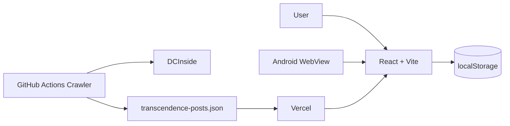

<div align="center">


# 🟡 GoldenDaughter

### 금딸 기록 · 체크인 · 동기부여 콘텐츠를 한곳에서

**현재 연속 기록을 실시간으로 확인하고,**  
**하루 단위 체크인과 초월 글을 통해 꾸준한 기록을 이어갈 수 있도록 만든 개인용 앱입니다.**

[](https://golden-daughter.kro.kr)
[](https://golden-daughter.kro.kr/GoldenDaughter.apk)

[](https://react.dev/)
[](https://vite.dev/)
[](https://vercel.com/)
[](https://github.com/features/actions)

</div>

---

## 🚀 서비스 개요

**GoldenDaughter**는 금딸 시작일만 저장하는 단순 DAY 카운터가 아니라, 현재 기록과 일일 체크인을 꾸준히 관리할 수 있도록 만든 개인용 기록 앱입니다.

기존에는 Spring Boot + PostgreSQL + Railway 구조를 사용했지만, 실제 사용자가 본인 한 명인 상황에서 서버 유지비를 없애기 위해 **서버리스 로컬 저장 방식**으로 변경했습니다.

현재 사용자 데이터는 서버가 아니라 **브라우저 또는 Android WebView의 localStorage에만 저장**됩니다.

> 서버 비용은 없지만 앱 데이터 삭제, 브라우저 데이터 초기화, 기기 초기화 시 기록이 사라질 수 있으므로 백업 기능을 제공합니다.

### 🔗 주요 링크

| 서비스 | URL |
| --- | --- |
| Web App | [golden-daughter.kro.kr](https://golden-daughter.kro.kr) |
| Android APK | [GoldenDaughter.apk](https://golden-daughter.kro.kr/GoldenDaughter.apk) |
| Legacy Backend | [GoldenDaughter_BackEnd](https://github.com/dh1180/GoldenDaughter_BackEnd) |

---

## ✨ 핵심 기능

### ⏱ 현재 Streak

- 실제 시작 날짜/시간 지정
- 현재 `DAY` 표시
- 시작 시각 기준 경과시간 실시간 계산
- 다음 목표 DAY 표시
- 기록 리셋
- 리셋된 이전 기록은 로컬 history에 보존

### 📅 일일 체크인

월간 캘린더에서 날짜별 상태와 메모를 저장합니다.

- `SUCCESS` — 성공
- `CRISIS` — 위기 있었음
- `FAILED` — 실패
- 날짜별 메모 작성
- 기존 체크인 수정
- 모든 기록은 localStorage에 저장

### 🌌 DCInside `초월` 글

상시 백엔드 서버 대신 **GitHub Actions가 현자타임 갤러리의 `초월` 말머리 글을 주기적으로 수집**합니다.

```text
DCInside
   ↓
GitHub Actions Crawler
   ↓
public/transcendence-posts.json
   ↓
Vercel
   ↓
GoldenDaughter
```

- 최초 실행 시 과거 페이지 전체 Backfill
- 이후 최신 페이지를 주기적으로 다시 확인
- 게시글 번호 기준 중복 제거
- JSON 파일을 정적 배포
- 앱에서 랜덤 글 노출
- 원문 바로가기

### 📊 개인 통계

- 현재 기록
- 최고 기록
- 성공 체크인 수
- 실패 체크인 수

### 💾 백업 / 복원

로컬 저장 방식의 데이터 유실에 대비해 백업 기능을 제공합니다.

- JSON 백업 파일 저장
- 백업 JSON 클립보드 복사
- JSON 백업 파일 가져오기

### 📱 Android App

웹과 별도 UI를 다시 만드는 대신 **Native Android WebView Wrapper**로 동일한 React 앱을 Android에서 실행합니다.

- Android WebView 기반
- 내부 서비스 링크는 앱 내부에서 유지
- 외부 링크는 기본 브라우저로 실행
- 상태바 / 시스템 영역 대응
- WebView 캐시 비활성화
- 앱 실행 시 최신 웹 배포본 요청
- GitHub Actions에서 APK 자동 빌드

현재 Android 앱 버전은 `1.0.6`입니다.

---

## 🏗 Architecture



### 이전 서버 구조와 비교

```text
Before
React / Android
      ↓
Spring Boot
      ↓
PostgreSQL
      ↓
Railway

After
React / Android
      ↓
localStorage
```

회원가입, 로그인, JWT, 사용자 순위 기능은 개인용 로컬 앱 전환과 함께 제거했습니다.

---

## 🔄 Legacy Server Data Migration

기존 Railway 서버에서 사용하던 기록이 있는 경우 새 로컬 버전을 처음 실행할 때 기존 JWT가 남아 있으면 자동으로 한 번 가져옵니다.

이관 대상:

- 닉네임
- 현재 Streak 시작 시각
- 날짜별 Check-in
- 기존 최고 기록

이관 완료 후 JWT는 삭제되며 이후 앱 사용에 Backend API가 필요하지 않습니다.

---

## 🛠 기술 스택

### Frontend

|  |  |  |  |
| :---: | :---: | :---: | :---: |
| React 19 | Vite 8 | JavaScript | CSS |

### Storage & Content

<p>
  
  
  
</p>

### Deployment

|  |  |  |
| :---: | :---: | :---: |
| Vercel | GitHub Actions | Android WebView |

---

## 📁 Project Structure

```text
GoldenDaughter_FrontEnd/
├── src/
│   ├── App.jsx
│   ├── localData.js
│   ├── api.js                 # 기존 서버 기록 1회 이관용
│   ├── main.jsx
│   └── styles.css
├── scripts/
│   └── update_transcendence_posts.py
├── public/
│   ├── transcendence-posts.json
│   └── GoldenDaughter.apk
├── android-app/
├── .github/workflows/
│   ├── android-apk.yml
│   └── update-transcendence-posts.yml
├── vercel.json
├── package.json
└── README.md
```

---

## 💻 Local Run

```bash
npm install
npm run dev
```

기본 개발 주소:

```text
http://localhost:5173
```

Backend 서버는 필요하지 않습니다.

---

## 🤖 DC Crawler

크롤러는 다음 명령으로 로컬에서도 실행할 수 있습니다.

```bash
pip install requests beautifulsoup4
python scripts/update_transcendence_posts.py
```

GitHub Actions에서는 매일 자동 실행되며 `public/transcendence-posts.json`에 변경이 있을 때만 커밋합니다.

---

## 🚀 Deployment

### Web

Vercel이 GitHub `main` 브랜치를 자동 배포합니다.

```text
https://golden-daughter.kro.kr
```

별도의 Backend URL 또는 DB 환경변수는 필요하지 않습니다.

### Android

APK는 GitHub Actions에서 빌드해 다음 경로로 배포합니다.

```text
https://golden-daughter.kro.kr/GoldenDaughter.apk
```

일반적인 React 기능 변경은 웹 배포만으로 Android WebView에도 반영되며, Android 네이티브 코드가 바뀐 경우에만 새 APK가 필요합니다.

---

## 📌 저장 방식 주의사항

GoldenDaughter는 현재 개인용 앱으로 운영되며 계정 서버가 없습니다.

따라서 다음 작업을 수행하기 전에는 반드시 JSON 백업을 권장합니다.

- 브라우저 데이터 삭제
- GoldenDaughter 앱 데이터 삭제
- 휴대폰 초기화
- 다른 기기로 이동
