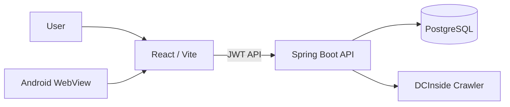

# GoldenDaughter FrontEnd

금딸 기록을 꾸준히 관리할 수 있도록 만든 **모바일 중심 웹 + Android 앱 프론트엔드**입니다.

사용자는 현재 연속 기록(DAY), 일일 체크인, 누적 통계, 사용자 순위와 DCInside `초월` 글을 한 화면에서 확인할 수 있습니다.

- Web: https://golden-daughter.kro.kr
- Android APK: https://golden-daughter.kro.kr/GoldenDaughter.apk
- Backend: https://github.com/dh1180/GoldenDaughter_BackEnd

---

## 주요 기능

### 홈
- 현재 금딸 연속 기록 `DAY` 표시
- 시작 시각 기준 실시간 경과시간 표시
- 다음 목표 DAY 표시
- 기록 시작 / 리셋
- DCInside 현자타임 갤러리 `초월` 글 랜덤 노출
- 다른 초월글 다시 불러오기
- 원문 바로가기

### 기록
- 월간 체크인 캘린더
- 날짜별 상태 기록
  - 성공
  - 위기 있었음
  - 실패
- 날짜별 메모 저장
- 다른 탭으로 이동 후 다시 돌아와도 선택 날짜의 기존 기록 동기화

### 순위
- 현재 진행 중인 금딸 기록을 기준으로 사용자 순위 계산
- 실제 시작 시각이 빠른 사용자가 상위 순위
- TOP 100 표시
- 내 순위 별도 표시
- 닉네임 / DAY / 경과시간만 공개

### 통계
- 현재 기록
- 최고 기록
- 성공 체크인 수
- 실패 체크인 수

### Android 앱
- Native Android `WebView` 기반 APK
- 사이트 내부 링크는 앱 안에서 유지
- 외부 링크는 기본 브라우저로 열기
- Android 상태바 / 시스템 영역 대응
- WebView 캐시를 사용하지 않고 앱 실행 시 최신 배포본 우선 로드

---

## Tech Stack

| 영역 | 기술 |
| --- | --- |
| Frontend | React 19 |
| Build | Vite 8 |
| API | Native Fetch API |
| Styling | CSS |
| Web Deploy | Vercel |
| Android | Java, WebView |
| Android SDK | compileSdk 36 / targetSdk 36 / minSdk 24 |
| CI/CD | GitHub Actions |

현재 Android 앱 버전은 `1.0.6`입니다.

---

## Architecture



웹과 Android 앱은 동일한 React 프론트엔드를 사용합니다.
Android APK는 `golden-daughter.kro.kr`을 WebView로 로드하므로 일반적인 프론트 기능 변경은 새 APK를 배포하지 않아도 웹 배포만으로 반영할 수 있습니다.

---

## Project Structure

```text
GoldenDaughter_FrontEnd/
├── src/
│   ├── App.jsx
│   ├── api.js
│   ├── main.jsx
│   └── styles.css
├── android-app/
│   └── app/
├── public/
│   └── GoldenDaughter.apk
├── .github/workflows/
├── vercel.json
├── package.json
└── README.md
```

---

## Local Run

### 1. 설치

```bash
npm install
```

### 2. 환경변수

프로젝트 루트에 `.env`를 생성합니다.

```env
VITE_API_BASE_URL=http://localhost:8080
```

### 3. 실행

```bash
npm run dev
```

기본 개발 주소:

```text
http://localhost:5173
```

### Build

```bash
npm run build
```

---

## API Authentication

로그인 후 발급받은 JWT는 API 요청 시 다음 형식으로 전달됩니다.

```http
Authorization: Bearer <JWT>
```

실제 사용자 식별과 데이터 분리는 Backend에서 처리합니다.

---

## Deployment

### Web

Vercel에서 배포하며 다음 환경변수가 필요합니다.

```env
VITE_API_BASE_URL=https://<backend-domain>
```

현재 서비스 도메인:

```text
https://golden-daughter.kro.kr
```

### Android APK

`android-app` 프로젝트를 GitHub Actions에서 빌드한 뒤 생성된 APK를 다음 경로로 배포합니다.

```text
/GoldenDaughter.apk
```

APK 응답에는 캐시를 사용하지 않도록 `Cache-Control: no-store`가 설정되어 있습니다.

---

## 화면 흐름

```text
회원가입 / 로그인
        ↓
홈 - 현재 DAY / 경과시간 / 초월글
        ↓
기록 - 날짜별 체크인 / 메모
        ↓
순위 - TOP 100 / 내 순위
        ↓
통계 - 현재·최고 기록 / 체크인 통계
```

---

## Related Repository

- Backend: https://github.com/dh1180/GoldenDaughter_BackEnd
